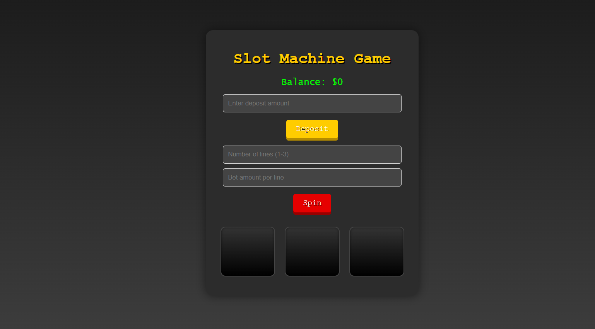

## 🎰 Slot Machine Game
#### A simple, fun, and interactive Slot Machine Game with two versions:

`🖥️ Browser Version: A graphical UI-based game using HTML, CSS, and JavaScript`

`💻 Command Line Version: A terminal-based version using Node.js`

`Test your luck, spin the reels, and try to win big! 💰`

## 🗂️ Project Structure
```
📦 slot-machine-game
├── index.html         // Browser version
├── styles.css         // Styling for browser version
├── project.js         // JS for browser version
├── script.js          // JS for command-line version
├── screenshot.png     // Screenshot preview
└── README.md
```
  
[Slot Machine][https://slot-machine-game-orpin.vercel.app/]

## 🌐 Browser Version
This version runs in any modern browser and provides a fully styled slot machine interface.

✅ Requirements
Any modern web browser (Chrome, Firefox, Edge, Safari)

▶️ Running the Game
Clone or download this repository.

Open index.html in your browser.

Follow the instructions on-screen to deposit, place bets, and spin!

## 🖥️ Command Line Version
This version runs in the terminal and interacts via prompts.

✅ Requirements
Node.js installed on your system

▶️ Running the Game
Clone or download this repository.

Open a terminal and navigate to the project directory.

### Run the following command:

### 🌐 Browser Version
- Enter a deposit amount and click "Deposit".
- Set the number of lines (1–3) and the bet amount per line.
- Click "Spin" to play.
- Check results and updated balance.
- If you run out of money, click "Play Again" to restart.

### 💻 Command Line Version
- Enter a deposit amount when prompted.
- Choose number of lines to bet on (1–3).
- Set bet per line.
- Game shows results and updates your balance.
- If balance is $0, game ends. Run node script.js to restart.

## 🛠️ Features
🎮 Fully functional game logic (GUI & CLI)

💵 Balance management with deposits and betting

🔁 Randomized spins

🎨 Retro-styled UI (browser)

💬 Real-time feedback on spins and results

❌ Input validation to prevent invalid plays

## 🚀 Tech Stack
- JavaScript – Game logic for both CLI and browser
- HTML/CSS – Layout and styling for the browser version
- Node.js – Command line game execution

## 🧮 Game Logic
- Symbols have different probabilities and payout values
- Winning condition: matching symbols in any row
- Winnings = symbol value × bet per line
- Inputs are validated (e.g., insufficient funds or over-bet)

## 🧩 Example Gameplay
`Deposit: $100`
`Lines: 3`
`Bet/line: $10`
`Click "Spin" or confirm in terminal...`

```
C D B  
B B C  
B B C
```  
`Matching row = win!`

`Winnings added to balance, otherwise deducted.`

## 🙌 Acknowledgments
- Built with vanilla JavaScript and lots of fun!
- UI inspired by classic slot machines
- Game logic based on randomness, probabilities, and payout strategies
